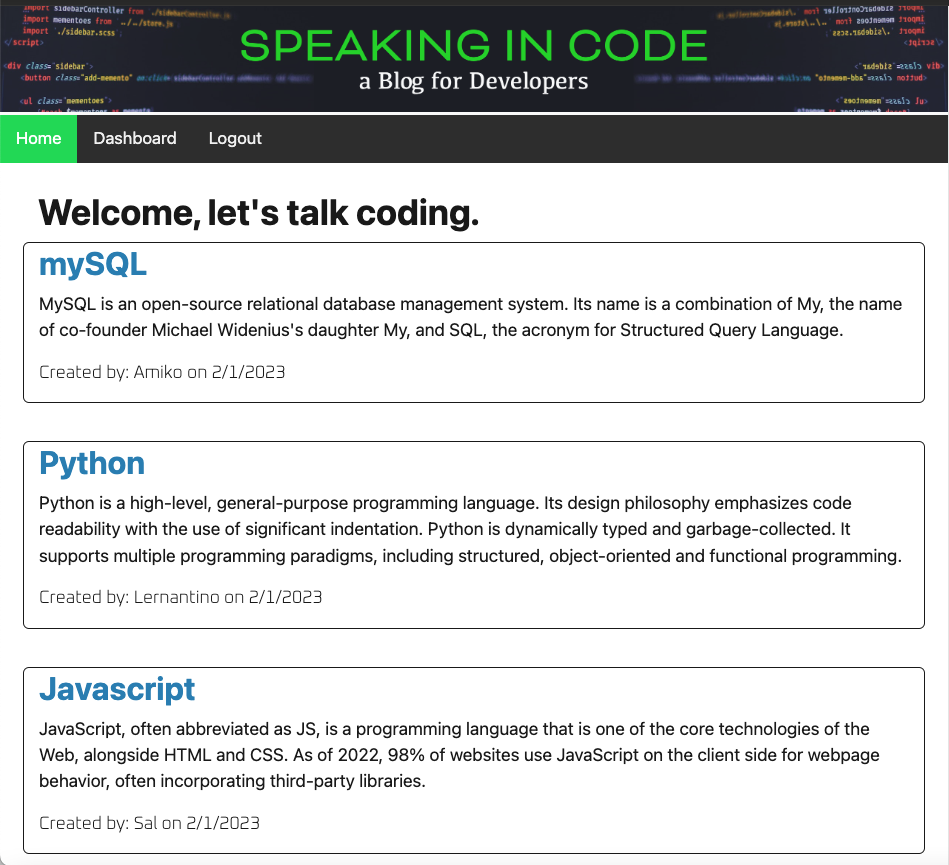
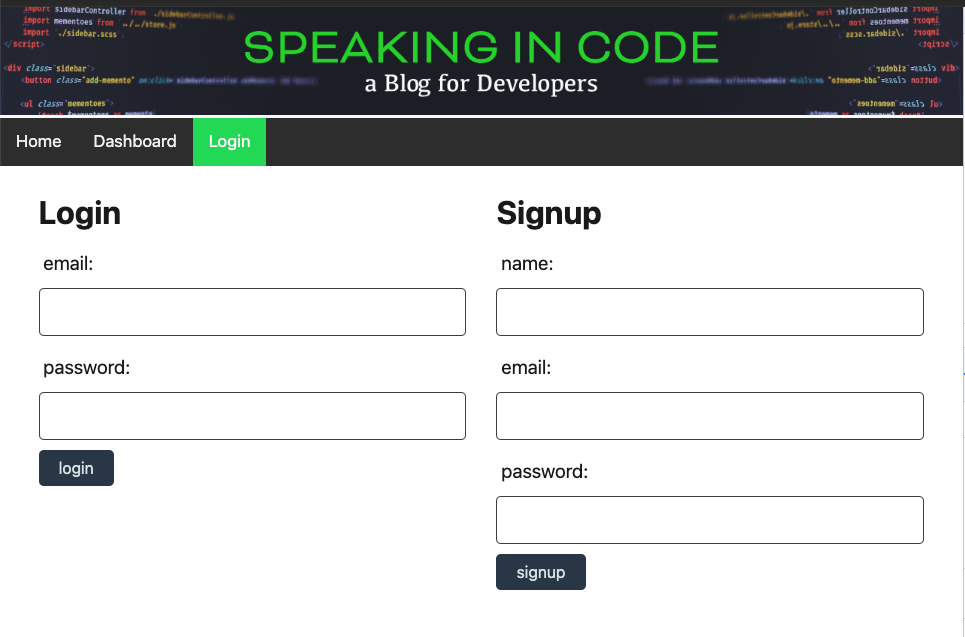
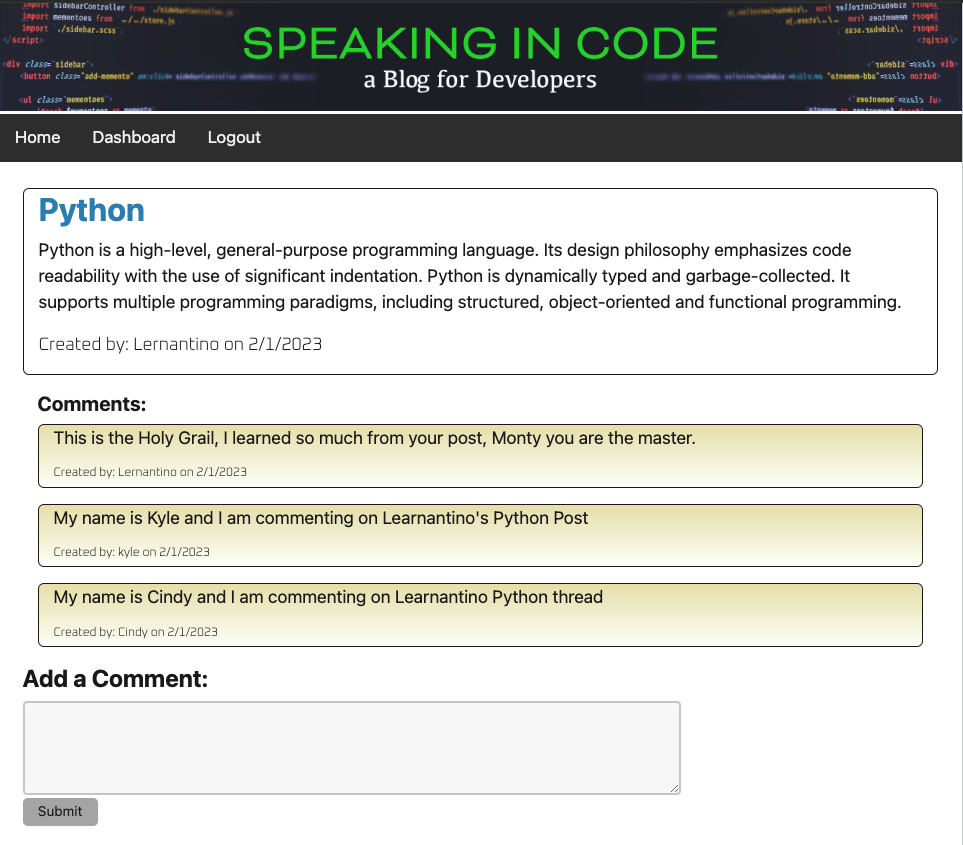
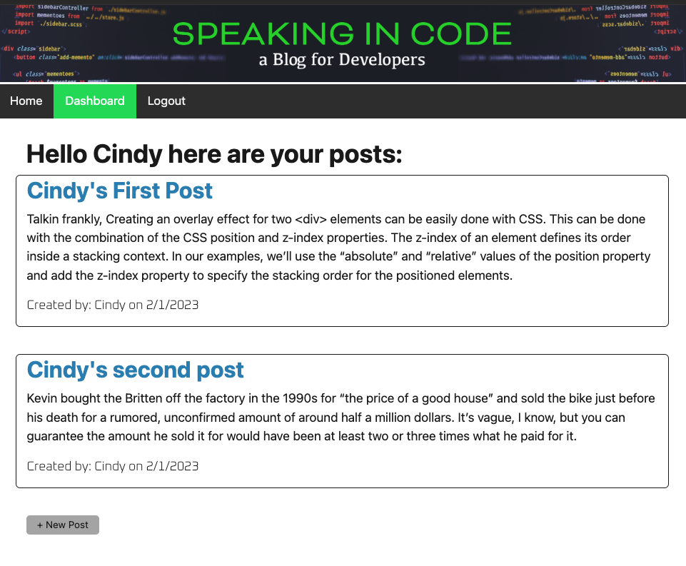
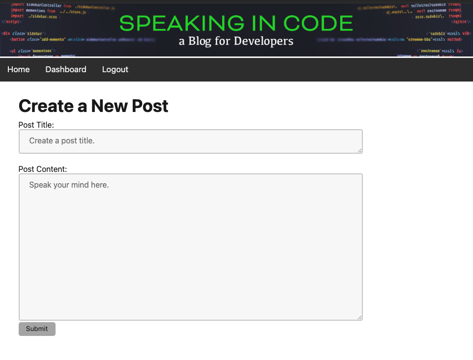
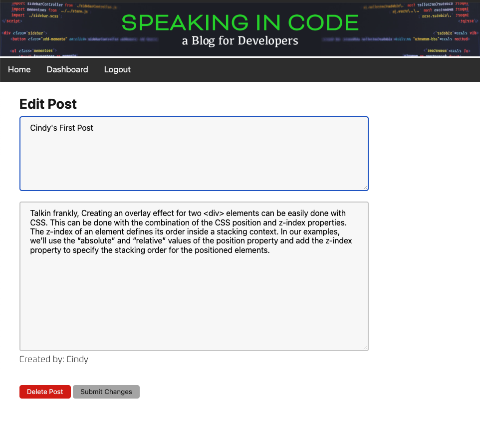

# Speaking in Code (Tech-Blog)
A site for developers to share technical concepts, recent advancements, and new technologies.

## Description

A blog web site where developers can publish their blog posts and comment on other developers’ posts as well. It provides a platform for developers to talk about programming languages and related topics. The site allows users to create an account, create posts, view all postings from all users, comment on any post, view only the post they created,  and edit and delete their own post. The site facilitates the sharing of knowledge and information. Building the site allowed me to follow the MVC paradigm in its architectural structure, using Handlebars.js as the templating language, Sequelize as the ORM, and the express-session npm package for authentication.

## Installation

There is no installation, URL access through the browser via: 

## Usage

Visit the site at:

The home page shows all blog posts.

Choose login from the nav bar, create an account, or login with existing email and password. Attempting to interact with the site while not logged in will redirect the user to the login page. Once logged in the user can navigate and interact with the site.

Once logged in you can preview any post by clicking on the title, once on the preview page, you can read and comment in the post thread.

While logged in if you click "Dashboard" in the Nav bar, you will see only post created by you.

While logged in you can click "Create Post Button" from the home page or the dashboard to create a new post.

While logged in if you click on a post title to preview it and that post belongs to you, you will see an "Edit" Button, that allows you to edit the title or content of the post and the option to delete the post entirely, along with any associated comments. This feature is only available to the owner of the post.

## Credits

https://www.w3schools.com/

https://stackoverflow.com/

https://chat.openai.com/chat

## License

MIT, Please refer to the license in the Repo.
